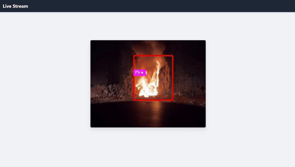

# Real-Time Frame Processing with Flask

## Project Overview

Real-Time Frame Processing with Flask is a web application that processes video frames in real-time using Flask. This project demonstrates how to handle and manipulate video streams efficiently with Python and Flask.

## Features

- Real-time frame processing
- Easy integration with web applications
- Customizable processing logic

## Installation

1. Clone the repository:
   ```bash
   git clone https://github.com/omartarekmoh/Real-Time-Frame-Processing-with-Flask.git
   cd Real-Time-Frame-Processing-with-Flask
   ```

2. Create and activate a virtual environment:
   ```bash
   python -m venv venv
   source venv/bin/activate   # On Windows use `venv\Scripts\activate`
   ```

3. Install the required dependencies:
   ```bash
   pip install -r requirements.txt
   ```

## Usage

1. Run the Flask application:
   ```bash
   flask run
   ```

2. Open your web browser and navigate to `http://127.0.0.1:5000`.

## Demonstration

Here is a preview of the project in action:



> Note: If you do not have the gif version of the video, you can convert it using tools like [Giphy](https://giphy.com/create/gifmaker) or [ezgif](https://ezgif.com/video-to-gif).

## Contributing

Contributions are welcome! Please fork the repository and create a pull request with your changes.

## License

This project is licensed under the MIT License. See the [LICENSE](LICENSE) file for details.

## Contact

For any inquiries or issues, please open an issue on the [GitHub repository](https://github.com/omartarekmoh/Real-Time-Frame-Processing-with-Flask/issues).

---

Enjoy processing your frames in real-time with Flask!
